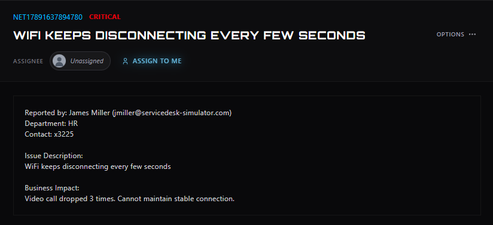

# Ticket #01-WiFi Keeps Disconnecting Every Few Seconds

**Ticket ID:** NET17891637894780\
**Category:** Network\
**Priority:** Critical\
**Reported by:** James Miller, HR (x3225)\
**Tools used:** Ticketing system, chat\

## Reported Issue
User reported WiFi disconnecting every few seconds, dropping a video call 3 times.

## Business Impact
Active video call disrupted repeatedly, blocking communication for HR staff.

## Action Taken
Assigned ticket to self and reached out to the user to confirm current status before
starting diagnostics. User reported the connection had already come back on its own
likely a brief outage and confirmed everything was stable.

## Outcome
No further troubleshooting needed. Verified with user that the issue was fully resolved
before closing. Ticket closed as self-resolved (transient outage).

