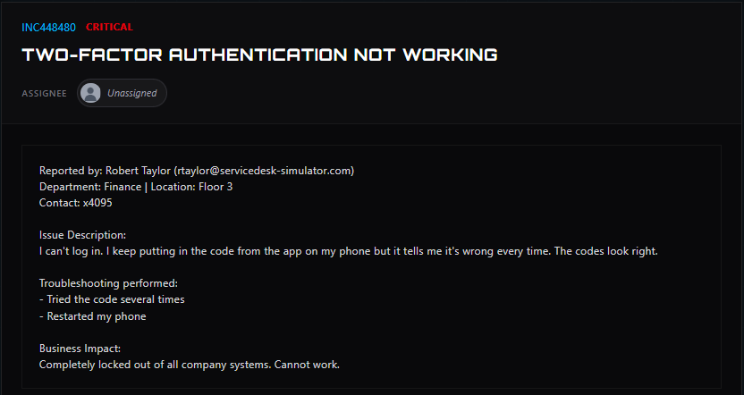
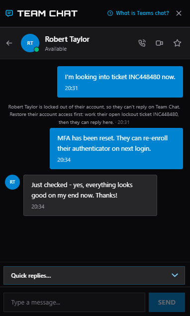

# Ticket #02-Two Factor Authentication Not Working

**Ticket ID:** INC448480\
**Category:** Security\
**Priority:** Critical\
**Reported by:** Robert Taylor, Finance (x4095)\
**Tools used:** Ticketing system, chat, AD

## Reported Issue
User reported all company systems can't be accessed due to two-factor authentication not working.

## Business Impact
User completely locked out of all company systems.

## Action Taken
 1-Assigned ticket to self and reached out to the user to confirm current status before\
 2-starting diagnostics.\
   2.1-Confirmed the account itself was active (not locked/disabled).\
   2.2-narrowed issue to authenticator app being out of sync.\
 3-reset the user MFA.\
 4-Contact the user and inform that he can re-enroll their authenticator on next login.

## Outcome
resetted MFA. Verified with user that the issue was fully resolved
before closing. Ticket closed as MFA issue.

