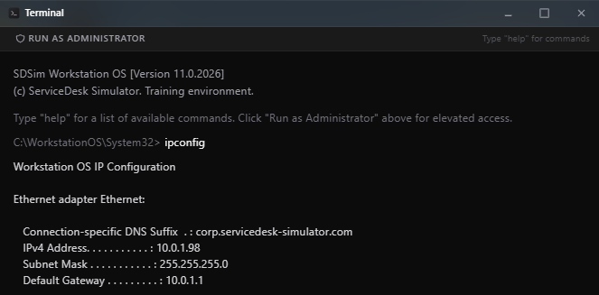

# Ticket #03-Internet Completely Down - Cannot Access Anthing

**Ticket ID:** NET17893247672002 \
**Category:** Network\
**Priority:** Critical\
**Reported by:** Jennifer Walsh, Marketing (x5101)\
**Tools used:** Ticketing system, chat, RDP

## Reported Issue
User reported that he cannot access anything.\

## Business Impact
Cannot access email, cloud apps, or any websites. Work completely halted.\
halted, affecting all employees and devices company-wide.

## Action Taken
 1. Assigned ticket to self and reached out to the user to confirm current status
   before starting diagnostics.
 2. Remoted into the user's PC to check connection to the domain status.\
    2.1Ran `ipconfig` : workstation had a valid IP (10.0.1.98), gateway, and DNS suffix.\
    
 3. Upon contacting the ISP, they confirmed that the network status was down, with an ETA of 30 to 60 minutes for resolution.

## Outcome
Confirmed ISP-side outage affecting all company employees and devices, with an ETA of 30–60 minutes.

