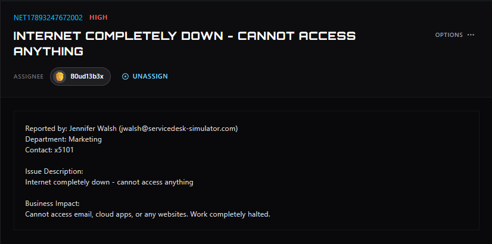
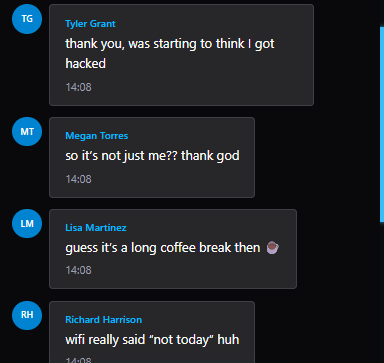

# Ticket #0-

**Ticket ID:** NET17893247672002 \
**Category:** \
**Priority:** \
**Reported by:** Jennifer Walsh, Marketing (x5101)\
**Tools used:** Ticketing system, chat, RDP

## Reported Issue
User reported that he cannot access anything.\

## Business Impact
Cannot access email, cloud apps, or any websites. Work completely halted.\
Upon investigation, ISP was down which resulted in downtime of 60min for all company's employees
## Action Taken
 1. Assigned ticket to self and reached out to the user to inform that diagnoses stated.\
 2. Remote access to the user's pc to check connection to the domain status.
 3. Upon contacting the ISP, they confirmed that the network status was down, with an ETA of 30 to 60 minutes for resolution.

## Outcome
An internet outage has an ETA of 30-60 min , which effected all employees and devices of the company .

